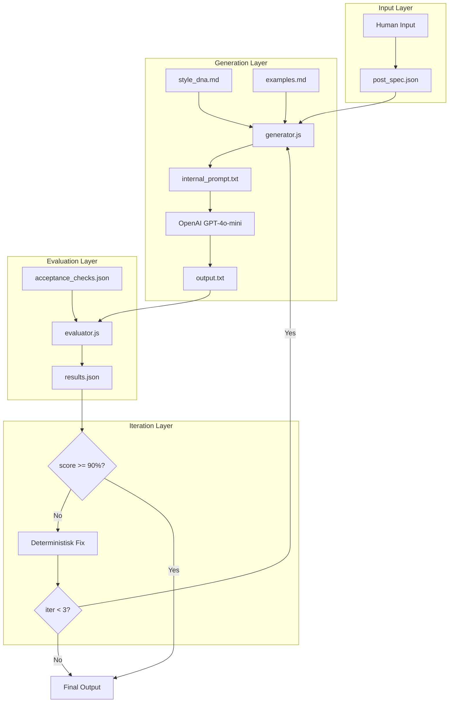

# Reflektera Text Harness v1

## Arkitektur



## Filstruktur

```
./harness/
├── post_spec.json              # Mall/schema för körningar
├── acceptance_checks.json      # Checks per profil (brev + warm_provocation)
├── style_dna.md               # DNA för profiler
├── examples.md                # Fragment-exempel per profil
├── runner.js                  # CLI entrypoint
├── lib/
│   ├── generator.js           # Skapar internal_prompt + kallar LLM
│   ├── evaluator.js           # Kör checks mot output
│   ├── iterator.js            # Deterministisk förbättring
│   └── checks/
│       ├── regex-checks.js    # Regex-baserade checks
│       ├── heuristic-checks.js # Heuristik-checks
│       └── llm-judge.js       # LLM-baserade bedömningar
├── specs/                     # Exempel-specifikationer
│   ├── brev_smallbarn.json
│   └── warm_provocation_konflikter.json
└── runs/                      # Körloggar (skapas automatiskt)
```

## 1. Core Artifacts

### 1.1 post_spec.json (mall)

Schema för varje körning med:
- `meta`: version, created_at
- `channel`: linkedin
- `profile`: brev | warm_provocation
- `topic`, `audience`, `user_input`
- `constraints`: no_asterisks, language, max/min_chars, signature
- `controls`: friction (1-5), warmth (1-5), story (1-5), seed

### 1.2 acceptance_checks.json

**Brev-profil (7 checks):**
| ID | Check | Type |
|----|-------|------|
| B001 | Direct address ("Du som...", "Till dig som...") i första 2 raderna | regex |
| B002 | 2-3 sensoriska mikrodetaljer (tid/plats/kropp/föremål) | heuristic |
| B003 | Whitespace: minst 8 radbrytningar, minst 3 ensamma meningar | heuristic |
| B004 | Sårbar auktoritet ("Jag har varit där/jag minns...") | regex |
| B005 | Reframing: vändning från skuld/stress till mänsklighet/tillåtelse | llm_judge |
| B006 | Mjuk slutsats: inga hårda CTA:s i sista 3 raderna | regex |
| B007 | Längd: 800-1200 tecken | heuristic |

**Warm Provocation-profil (6 checks):**
| ID | Check | Type |
|----|-------|------|
| W001 | Avslöjande hook i första 2-3 meningarna | llm_judge |
| W002 | Minst 1 vardagsmiljö (Slack/Teams/korridor/möte) | regex |
| W003 | Minst 1 listsekvens med tankstreck (3-5 rader) | regex |
| W004 | Minst 1 rytmisk paus ("Nej." "Nej nej." "Exakt.") | regex |
| W005 | Minst 1 metafor ("som att...", "är som...") | regex |
| W006 | Signaturblock i slutet | regex |

### 1.3 style_dna.md

Två profiler med DNA-beskrivningar:

**Brev:**
- Emotionell närhet före åsikt
- Mikrosituationer (frukostbord, termometer, famn, panna)
- Whitespace och ensamma meningar
- Sårbar auktoritet ("Jag har varit du")
- Reframing: skuld → mänsklighet
- Mjuk slutsats utan CTA

**Warm Provocation:**
- Avslöjande hook (självbedrägeri)
- Vardags-hyckleri (Slack, korridor, möte)
- Listor med tankstreck
- Rytmiska pauser
- Metaforer
- Varm men självsäker CTA

### 1.4 examples.md

5-7 korta fragment per profil (inga hela inlägg):

**Brev:**
- "Du som jonglerar..."
- "Jag har varit du."
- "Jag minns känslan i magen när..."
- "Det var aldrig inget särskilt. Det var livet."
- "Du gör det bästa du kan. Och det är nog."

**Warm Provocation:**
- "Du är inte konflikträdd. Du är konfliktointresserad."
- "Nej nej."
- "Det är som att säga att man älskar höjder – men bara när man står på marken."
- "passivt aggressiv blinkning i Slack"

## 2. Runner CLI

Implementeras i [harness/runner.js](harness/runner.js) med kommandon:

```bash
npm run harness -- generate --spec ./specs/brev_smallbarn.json
npm run harness -- eval --run ./runs/2025-01-01_120000
npm run harness -- iterate --target 90 --max 3
npm run harness -- run --spec ./specs/brev_smallbarn.json  # generate+eval+iterate
npm run harness -- compare --run ./runs/2025-01-01_120000
```

### 2.1 generate

1. Läser `post_spec.json`
2. Laddar `style_dna.md` och `examples.md`
3. Bygger `internal_prompt.txt` baserat på profil
4. Kallar OpenAI med seed från spec
5. Sparar output till `runs/YYYY-MM-DD_HHMMSS/output_v1.txt`

### 2.2 eval

1. Laddar output och `acceptance_checks.json`
2. Kör varje check (regex → heuristic → llm_judge)
3. Beräknar viktad score
4. Sparar `results_v1.json` med pass/fail per check

### 2.3 iterate

1. Om score < target (default 90%)
2. Identifierar första failade check
3. Applicerar deterministisk fix i ordning: hook → lista → miljö → rytm → metafor → signatur
4. Genererar ny version (max 3 iterationer)
5. Sparar alla versioner

### 2.4 compare

Skapar diff-rapport mellan versioner med förklaring av score-ändringar.

## 3. Internal Prompt Generator

Logik i [harness/lib/generator.js](harness/lib/generator.js):

```javascript
function buildInternalPrompt(spec, styleDna, examples) {
  // 1. Hämta profil-DNA
  // 2. Hämta relevanta fragment från examples.md
  // 3. Bygg prompt med constraints
  // 4. Guardrail: "efterlikna känsla och form, inte återanvänd formuleringar"
  // 5. Returnera komplett internal_prompt
}
```

## 4. Logging

Varje run skapar:
```
./runs/2025-01-01_120000/
├── post_spec.json          # Snapshot av input
├── internal_prompt_v1.txt  # (och v2/v3 om iterate)
├── output_v1.txt           # (och v2/v3)
├── results_v1.json         # (och v2/v3)
├── summary.md              # Score, failures, next fix
└── diff.md                 # (om compare körs)
```

## 5. Exempel-specifikationer

### specs/brev_smallbarn.json
Med user_input från "HUMAN INPUT 1"

### specs/warm_provocation_konflikter.json
Med user_input från "HUMAN INPUT 2"

## 6. npm scripts

Läggs till i [package.json](package.json):

```json
{
  "scripts": {
    "harness": "node harness/runner.js",
    "harness:brev": "node harness/runner.js run --spec ./harness/specs/brev_smallbarn.json",
    "harness:warm": "node harness/runner.js run --spec ./harness/specs/warm_provocation_konflikter.json"
  }
}
```

## 7. End-to-End Test

Efter implementation körs:
1. `npm run harness:brev` - generate+eval för Brev-profilen
2. `npm run harness:warm` - generate+eval för Warm Provocation

Output visar score och vilka checks som failar för båda profilerna.

## Implementationsordning

1. Skapa mappstruktur och core artifacts (post_spec.json, acceptance_checks.json, style_dna.md, examples.md)
2. Implementera generator.js med internal prompt builder
3. Implementera evaluator.js med regex/heuristic checks
4. Implementera llm-judge för komplexa checks
5. Implementera iterator.js med deterministisk fix-logik
6. Skapa runner.js CLI
7. Skapa exempel-specifikationer
8. Uppdatera package.json med npm scripts
9. Köra end-to-end test
